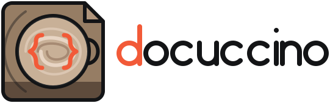

<p align="center">
  <picture>
    <source media="(prefers-color-scheme: dark)" srcset="art/logo.svg">
    <source media="(prefers-color-scheme: light)" srcset="art/logo-light.svg">
    
  </picture>
</p>

<!--
  The CI, Docs and Packagist badges resolve once this repository is public and the packages are
  registered on Packagist; they render as "invalid"/404 while the repository is private.
-->
<p align="center">
  <a href="https://github.com/docuccino/docuccino/actions/workflows/ci.yml"></a>
  <a href="https://github.com/docuccino/docuccino/actions/workflows/website.yml"></a>
  <a href="https://packagist.org/packages/docuccino/laravel"></a>
  <a href="LICENSE"></a>
  
  
</p>

# Docuccino

**API documentation for Laravel that documents change and provenance, not just endpoints.**
Docuccino compiles your application into a **UIR** — a Universal Intermediate Representation: an
OpenAPI 3.2-shaped, deterministic, identity-carrying JSON document — and emits OpenAPI 3.2/3.1 from
it. Because every operation, schema, and parameter carries a stable identity and per-node
provenance, and because output is byte-deterministic, the UIR answers *what changed* and *why is it
documented this way* — not merely *what are the endpoints*. It's the input a downstream SaaS turns
into changelogs, mock servers, and agent-facing tool schemas.

## Quickstart

```bash
composer require docuccino/laravel
php artisan vendor:publish --tag="docuccino-config"
php artisan docuccino:export            # → docs/openapi.json
```

Then open the bundled **Scalar** viewer at `/docs/api` (available in `local` by default; gate it to
expose it elsewhere). Full walkthrough: **[Getting started](https://docs.docuccino.app/laravel/getting-started/)**.

## Why Docuccino

- **Inferred exception handlers** — error responses are read from your app's *real* exception
  handling (render callbacks, `render()`, `Responsable::toResponse()`), analysed with the thrown
  type narrowed so `instanceof` branches resolve. Error docs are automatic, zero config.
- **Deep Query Builder chains** — `allowedFilters`/`allowedSorts`/`allowedIncludes` are recovered by
  constant-folding through helper methods at *any* chain depth, and pagination params appear when
  the call graph reaches a paginating terminal. No hand-written `#[QueryParameter]` lists.
- **Semantic diff you can gate on** — `docuccino:diff --enforce` compares two artifacts over stable
  identities and enforces a versioning policy (semver / date / none); a breaking change without the
  right version bump fails the build.
- **Determinism as a feature** — byte-identical output for identical code (canonical ordering, no
  timestamps, no absolute paths), verified by committed golden files and cold/warm & 1/8-worker
  byte-diff invariants in CI.
- **Tier-3 inference, no type system** — PHPStan + Larastan embedded behind a `TypeEngine` boundary;
  your own PHPStan extensions improve your docs with zero Docuccino-specific API.
- **MCP-ready UIR** — a JSON-Schema-defined document (published at `spec.docuccino.app`) carrying the
  provenance and identities downstream tooling needs.

**Coming from Scramble?** [Docuccino vs Scramble](https://docs.docuccino.app/guides/vs-scramble/)
compares the two fairly and maps your attributes, config, and extensions across.

## Packages

This is a monorepo, subtree-split into individual packages on release.

| Package | Directory | Role |
| --- | --- | --- |
| `docuccino/laravel` | [`packages/laravel`](packages/laravel/README.md) | The Laravel adapter: provider, config, commands, viewer, integrations. |
| `docuccino/core` | [`packages/core`](packages/core/README.md) | Framework-agnostic UIR model, canonicalizer, identities, emitters, diff, contracts. |
| `docuccino/inference-phpstan` | [`packages/inference-phpstan`](packages/inference-phpstan/README.md) | PHPStan + Larastan embedded behind core's `TypeEngine`. |
| `docuccino/attributes` | [`packages/attributes`](packages/attributes/README.md) | Dependency-free PHP attribute classes. |

The versioned UIR JSON Schema lives in [`spec/uir/`](spec/uir/) and is served at its `$id` URLs from
`spec.docuccino.app`.

## Documentation

Full documentation is at **[docs.docuccino.app](https://docs.docuccino.app)**:

- [Getting started](https://docs.docuccino.app/laravel/getting-started/)
- [Configuration reference](https://docs.docuccino.app/laravel/reference/configuration/) ·
  [Commands](https://docs.docuccino.app/laravel/reference/commands/) ·
  [Attributes](https://docs.docuccino.app/laravel/reference/attributes/)
- [Package support](https://docs.docuccino.app/laravel/packages/)
- [Extension authoring](https://docs.docuccino.app/extending/extension-authoring/) ·
  [Docuccino vs Scramble](https://docs.docuccino.app/guides/vs-scramble/)
- [UIR spec](https://docs.docuccino.app/uir/)

The docs site source lives in [`website/`](website/README.md) (Astro + Starlight).

## Contributing

See [CONTRIBUTING.md](CONTRIBUTING.md). Contributions require a DCO sign-off (`git commit -s`) and
follow Conventional Commits; determinism and the golden-file discipline are hard, tested guarantees.
Releases and the subtree split are described in [RELEASING.md](RELEASING.md).

## License

MIT © Docuccino. See [LICENSE](LICENSE).
